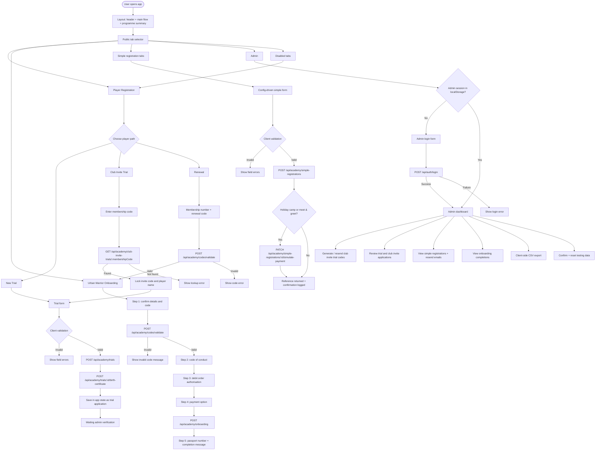
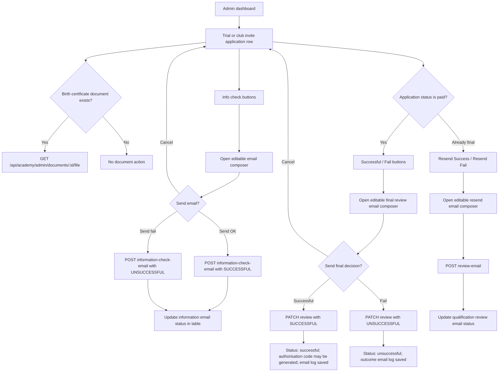
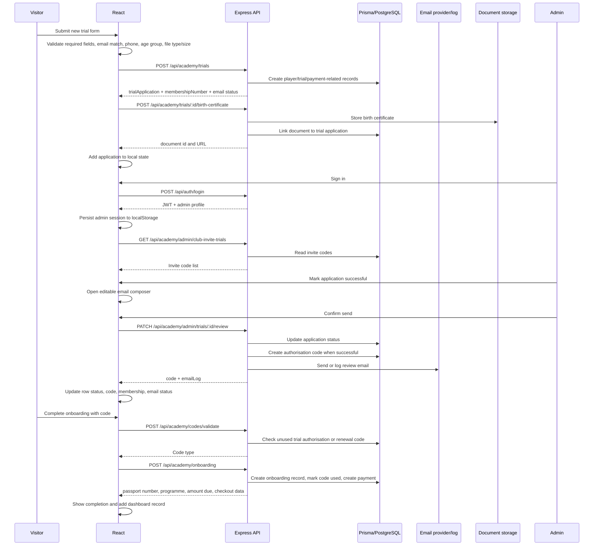
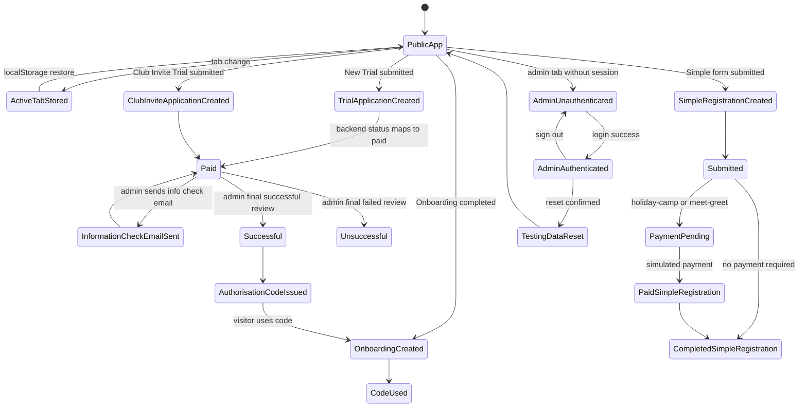

# Existing Interaction Logic

Source review date: 2026-06-15

This document maps the current interaction logic implemented in the React frontend and Express API. It is intended as a web design reference for screens, user paths, admin actions, and backend state changes.

## Screen And Role Flow

## Admin Review Flow

## Data And API Sequence

## State Flow

## Current Screen Inventory

| Area | Component | Primary actions | Backend endpoints |
| --- | --- | --- | --- |
| App shell | `App`, `Layout`, `Tabs` | Restore active tab, render selected flow, show programme summary | `GET /api/academy/trials`, `GET /api/academy/club-invite-applications`, `GET /api/academy/simple-registrations` |
| Player Registration | `PlayerRegistration` | Select New Trial, Club Invite Trial, Renewal | `POST /api/academy/codes/validate` for Renewal |
| Trial Registration | `TrialRegistration` | Validate form, calculate age group, submit application, upload birth certificate | `POST /api/academy/trials`, `POST /api/academy/trials/:id/birth-certificate`, `GET /api/academy/club-invite-trials/:membershipCode` |
| Onboarding | `UrbanWarriorOnboarding` | Validate code, accept conduct, accept debit order, select payment, complete onboarding | `POST /api/academy/codes/validate`, `POST /api/academy/onboarding` |
| Simple Registrations | `PlaceholderForm` | Submit config-driven registration, simulate payment for selected types | `POST /api/academy/simple-registrations`, `PATCH /api/academy/simple-registrations/:id/simulate-payment` |
| Admin Login | `AdminLogin` | Authenticate admin | `POST /api/auth/login` |
| Admin Dashboard | `AdminPanel` | Generate invite codes, review applications, preview documents, resend emails, export CSV, reset testing data | `/api/academy/admin/*` endpoints |

## Design Notes

- The public navigation is tab-based, not route-based. `activeTab`, admin session, generated codes, and onboarding completions are persisted in `localStorage`.
- Several tabs are present but disabled in the public tab config: General Member, Urban Lounge Event, Club Event, and Match Tickets. The simple form logic exists for these types, but disabled tabs normalize back to Player Registration.
- Club Invite Trial is a two-step public path: lookup membership code first, then complete the same trial form with invite fields locked or prefilled.
- Admin email actions are intentionally mediated by an editable composer modal before API calls are made.
- Admin CSV export is client-side and uses current in-memory state, while backend also exposes admin export endpoints that are not currently wired in this frontend component.
- `generatedCodes` remains in local storage, but current successful trial and renewal validation depends on backend code validation.
