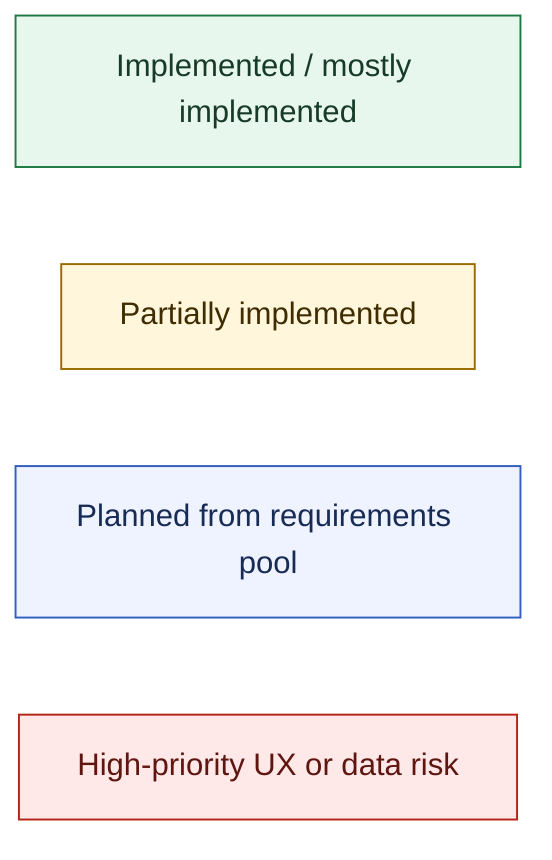
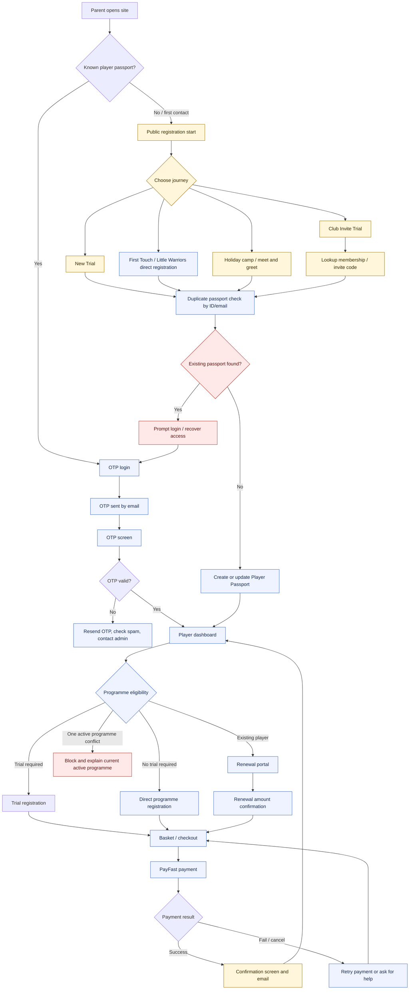
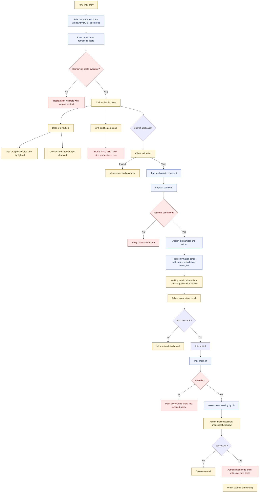
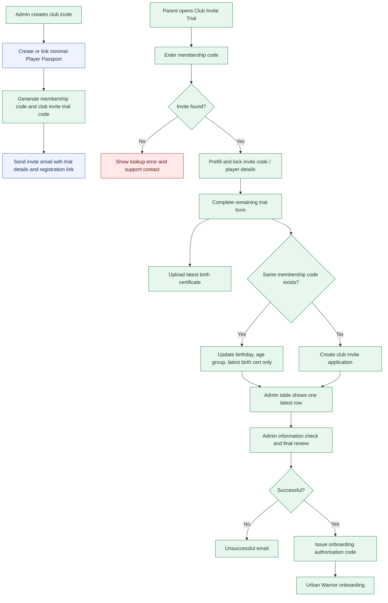
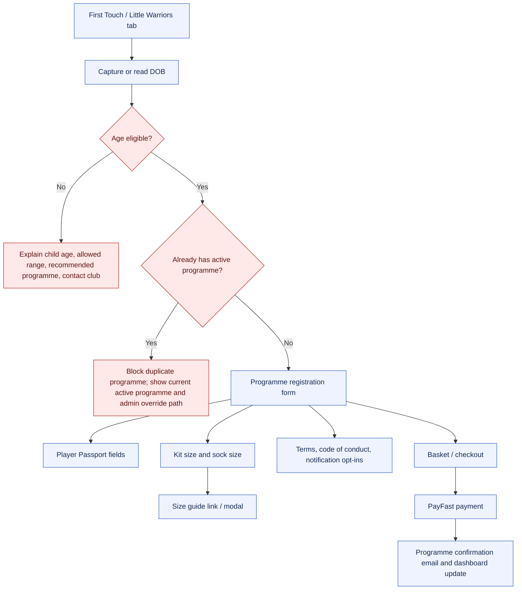
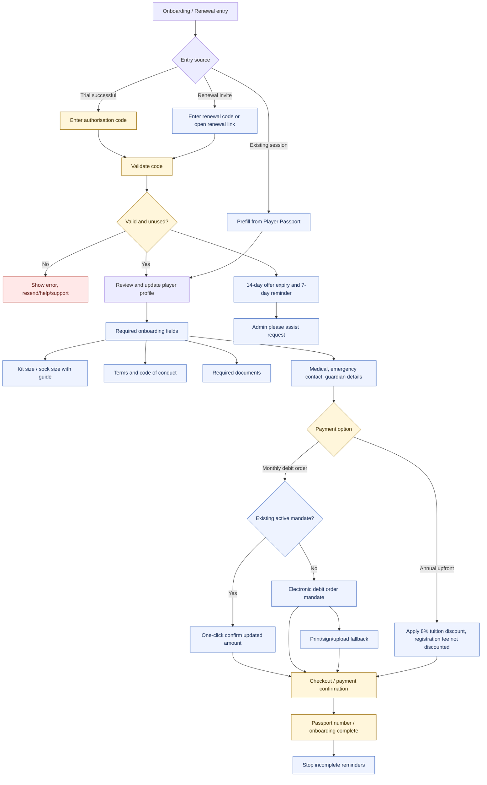
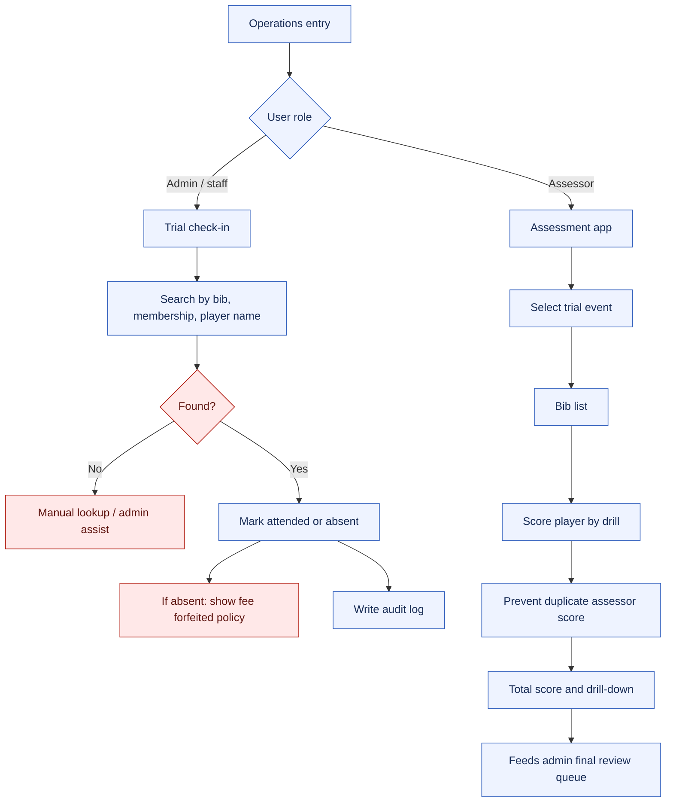

# UI Interaction Map From Requirements Pool

Source: `需求池.md`
Last updated: 2026-06-16

This map translates the requirements pool into a target UI interaction structure. It separates currently implemented UI from planned UI so design and development can discuss the whole product without confusing MVP scope with the final workflow.

## Legend

## 1. Overall UI Information Architecture

```mermaid
flowchart TD
  App["Cape Town Spurs Registration Platform"] --> Public["Public / parent-facing area"]
  App --> PlayerAuth["Player / guardian OTP login"]
  App --> PlayerDash["Player dashboard after login"]
  App --> AdminAuth["Admin login"]
  App --> AdminDash["Admin back office"]
  App --> OpsApps["Operations apps"]

  Public --> PublicTabs["Current public tabs"]
  PublicTabs --> PlayerReg["Player Registration"]
  PublicTabs --> PublicOnboarding["Urban Warrior Onboarding"]
  PublicTabs --> SimpleRegs["Simple registrations"]
  PublicTabs --> PublicSupport["Support footer on every user page"]

  PlayerAuth --> OtpRequest["Request OTP by email or membership number"]
  PlayerAuth --> OtpVerify["Enter OTP"]
  PlayerAuth --> OtpHelp["Resend, spam/junk hint, contact admin"]
  OtpVerify --> PlayerDash

  PlayerDash --> AcademyTab["Academy Programmes"]
  PlayerDash --> FirstTouchTab["First Touch"]
  PlayerDash --> LittleWarriorsTab["Little Warriors"]
  PlayerDash --> HolidayCampTab["Holiday Camps"]
  PlayerDash --> RenewalTab["Renewal"]
  PlayerDash --> ProfileTab["Player Passport / profile"]
  PlayerDash --> PaymentsTab["Payments and renewal status"]

  AdminDash --> TrialAdmin["Trial applications"]
  AdminDash --> ClubInviteAdmin["Club invite applications"]
  AdminDash --> InviteCodeAdmin["Club invite trial codes"]
  AdminDash --> PlayerAdmin["Players / passports"]
  AdminDash --> EmailAdmin["Email composer and logs"]
  AdminDash --> PaymentAdmin["Payment history and refunds"]
  AdminDash --> RenewalAdmin["Renewal selection workflow"]
  AdminDash --> AdminExport["CSV export"]
  AdminDash --> TestingReset["Testing data reset"]

  OpsApps --> CheckIn["Trial check-in"]
  OpsApps --> Assessment["Trial assessment app"]

  classDef done fill:#e8f7ee,stroke:#1f7a45,color:#173b27
  classDef partial fill:#fff6db,stroke:#9a6b00,color:#3f2c00
  classDef planned fill:#eef3ff,stroke:#315fbd,color:#172b55
  classDef risk fill:#ffe8e8,stroke:#b42318,color:#5f1510

  class Public,PublicTabs,PlayerReg,PublicOnboarding,SimpleRegs,AdminAuth,AdminDash,TrialAdmin,ClubInviteAdmin,InviteCodeAdmin,EmailAdmin,AdminExport,TestingReset done
  class PlayerDash,PlayerAdmin,PaymentsTab,PaymentAdmin,RenewalAdmin,OpsApps,CheckIn,Assessment,PublicSupport planned
  class PlayerAuth,OtpRequest,OtpVerify,OtpHelp,AcademyTab,FirstTouchTab,LittleWarriorsTab,HolidayCampTab,RenewalTab,ProfileTab risk
```

## 2. Parent / Player Main Journey

## 3. New Trial UI Flow

## 4. Club Invite Trial UI Flow

## 5. Direct Programme Registration UI Flow

## 6. Onboarding And Renewal UI Flow

## 7. Admin Back Office UI Flow

```mermaid
flowchart TD
  AdminLogin["Admin login"] --> AdminHome["Admin dashboard"]

  AdminHome --> SummaryCards["Summary cards"]
  AdminHome --> TrialTables["Trial and club invite tables"]
  AdminHome --> InviteManager["Club invite code manager"]
  AdminHome --> PlayerManager["Player Passport manager"]
  AdminHome --> TrialWindowManager["Trial window and capacity manager"]
  AdminHome --> RenewalManager["Renewal selection manager"]
  AdminHome --> PaymentManager["Payments, refunds, renewal status"]
  AdminHome --> EmailMatrix["Email matrix and logs"]
  AdminHome --> ExportReset["Export CSV / reset testing data"]

  TrialTables --> BirthCertPreview["View birth certificate"]
  TrialTables --> InfoCheck["Information check email"]
  TrialTables --> FinalReview["Qualification review"]
  InfoCheck --> RichComposer["Rich text email composer"]
  FinalReview --> RichComposer
  RichComposer --> EmailLog["Email status and log"]

  InviteManager --> GenerateInvite["Generate membership + invite code"]
  GenerateInvite --> SendInvite["Send invite email"]

  TrialWindowManager --> WindowConfig["Configure age group, date, capacity, arrival time"]
  WindowConfig --> RemainingSpots["Feeds remaining spots on trial form"]

  RenewalManager --> InviteRenewal["Invite to renew"]
  RenewalManager --> NotRenewing["Mark not renewing"]
  InviteRenewal --> RenewalEmail["Renewal email / code"]
  NotRenewing --> NotRenewingEmail["Not renewing email"]

  PaymentManager --> RefundPolicy["Refund and 20% admin fee policy"]
  PaymentManager --> PayFastRefund["PayFast refund action"]

  classDef done fill:#e8f7ee,stroke:#1f7a45,color:#173b27
  classDef partial fill:#fff6db,stroke:#9a6b00,color:#3f2c00
  classDef planned fill:#eef3ff,stroke:#315fbd,color:#172b55
  classDef risk fill:#ffe8e8,stroke:#b42318,color:#5f1510

  class AdminLogin,AdminHome,SummaryCards,TrialTables,InviteManager,ExportReset,BirthCertPreview,InfoCheck,FinalReview,RichComposer,EmailLog,GenerateInvite done
  class PlayerManager,EmailMatrix partial
  class TrialWindowManager,RenewalManager,PaymentManager,SendInvite,WindowConfig,RemainingSpots,InviteRenewal,NotRenewing,RenewalEmail,NotRenewingEmail,PayFastRefund planned
  class RefundPolicy risk
```

## 8. Operations UI Flow

## 9. Screen-To-Requirement Coverage

| UI area | Current state | Key requirements |
| --- | --- | --- |
| Public player registration | Partially implemented | R-004, R-005, R-006, R-008, R-010, R-013, R-014, R-021, R-022 |
| Player OTP login | Planned | W-NEW-001, R-018 |
| Player dashboard | Planned | W-NEW-002, W-NEW-013, R-019, R-024 |
| New Trial form | Partially implemented | R-002, R-004, R-006, R-008, R-014, W-NEW-004, W-NEW-005, W-NEW-006, W-NEW-007 |
| Club Invite Trial | Mostly implemented | R-005, R-007, D-008 to D-017, W-OPT-007 |
| First Touch / Little Warriors | Planned | R-013, W-NEW-013, W-OPT-008 |
| Onboarding | Partially implemented | R-015, R-016, R-017, W-NEW-014, W-NEW-015, W-OPT-009 |
| Renewal | Planned / partially scaffolded | R-020, W-NEW-011, W-NEW-012 |
| Admin dashboard | Mostly implemented for MVP | R-007, R-009, D-023 to D-027, W-NEW-017, W-NEW-018 |
| Trial check-in / no-show | Planned | R-023, W-NEW-008 |
| Trial assessment | Planned | W-NEW-009 |
| Payments / refunds | Planned beyond simulation | W-NEW-006, W-NEW-010 |
| Support and mobile QA | Planned | R-019, R-021 |

## Product Design Notes

- The target UI should move from public tabs toward a player passport dashboard once OTP login exists. Public tabs can remain as acquisition entry points, but authenticated users should land in a task-focused dashboard.
- Trial registration needs a stronger pre-payment decision surface: age group, trial window, remaining spots, fee policy, arrival time, and support contact should be visible before checkout.
- Onboarding and renewal should share a profile-review pattern: prefill known data, ask only what changed or is missing, then move to mandate/payment.
- Admin email actions should continue to use a confirmation composer, because the business frequently needs to tailor communication before sending.
- Support should be a persistent but quiet element on user-side flows, especially OTP, payment, onboarding, and age mismatch screens.
